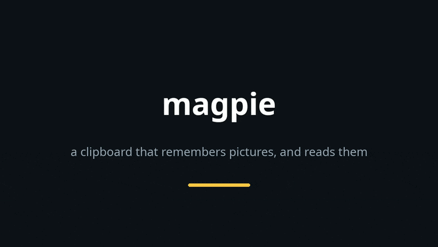

<div align="center">

# 🐦‍⬛ magpie

**A clipboard that keeps everything — including the pictures.**

The copies, the images, and the screenshot folder they mostly came from.
Every screenshot is read by OCR, so *"that receipt from the electricity people"*
is a search instead of an afternoon of scrolling.



</div>

---

### ✨ Why

Noctalia's clipboard is an `index.json` rewritten in full on every copy. That's why it caps
out: the setting says a hundred thousand entries and the file holds a hundred and thirteen.

magpie is SQLite. The hundred-thousandth copy costs exactly what the tenth did, and nothing
gets thrown away to make room.

### 📸 It reads your screenshots

A screenshot is a document you can't search, which is the whole problem with a folder of three
thousand of them.

Reading one is deliberately extravagant — read once, searched for years. Each picture is
flattened and then prepared several ways: **as it is**, **doubled** with a sharpen and a
contrast stretch (inverted first if the picture is dark, which is how a dark UI at 100% scale
becomes readable), and **tripled** if the text is too small to resolve at all. Every version is
read, and the wordiest answer wins. Results land in an FTS index.

Flattening comes first, always: a screenshot is RGBA, and inverting a transparent pixel turns
the whole picture into one flat colour that reads as nothing. That one cost an afternoon.

### ⌨️ Keys

```
Super + V           the clipboard
Super + Shift + V   straight into the screenshot browser
Escape              close          Enter    copy and close
↑ ↓ ← →             move           PgUp/Dn  ten rows at a time
anything else       goes into the filter box
```

Escape and Enter act on **release**, not press — closing on the press hands the keyboard back
before the key is let go, and the window underneath gets the release. That's how Escape used
to dismiss the dialog behind the clipboard, and how Enter left a newline in the editor.

### 🔊 And it makes two sounds

Opening is a **click** — seven milliseconds of noise under a steep decay, a switch rather than
a notification, because it happens every single time and has to be the kind of sound you stop
hearing. Copying is **one short note**, the only confirmation you get.

Both spawn detached. A window that waits eighty milliseconds for a speaker is worse than a
silent one.

### 🚀 Running it

```sh
magpie view              # the window
magpie search <query>    # find entries by their words
magpie shots [query]     # the screenshot browser
magpie ocr [n]           # read pictures nobody has read yet
magpie stats             # what the store holds
```

Timers keep it fed; `wl-paste --watch magpie store` catches every copy.

### 🧪 Trying it without showing anyone your clipboard

```sh
MAGPIE_CONFIG=/path/to/demo.toml magpie view
```

Points the whole program at another config, and so at another store. A sandboxed viewer also
takes its own identity rather than activating the instance already running — otherwise the
real clipboard answers and the sandbox is ignored in silence. *(The demo above is a planted
store. Ask me how I know.)*

### ✅ Tests

```sh
python -m pytest      # 262 passed
```

📓 The long version — the recovery of 815 entries from two dead stores, and why every decision
went the way it did — is in [`docs/notes.md`](docs/notes.md).

---

<div align="center"><sub>MIT</sub></div>
